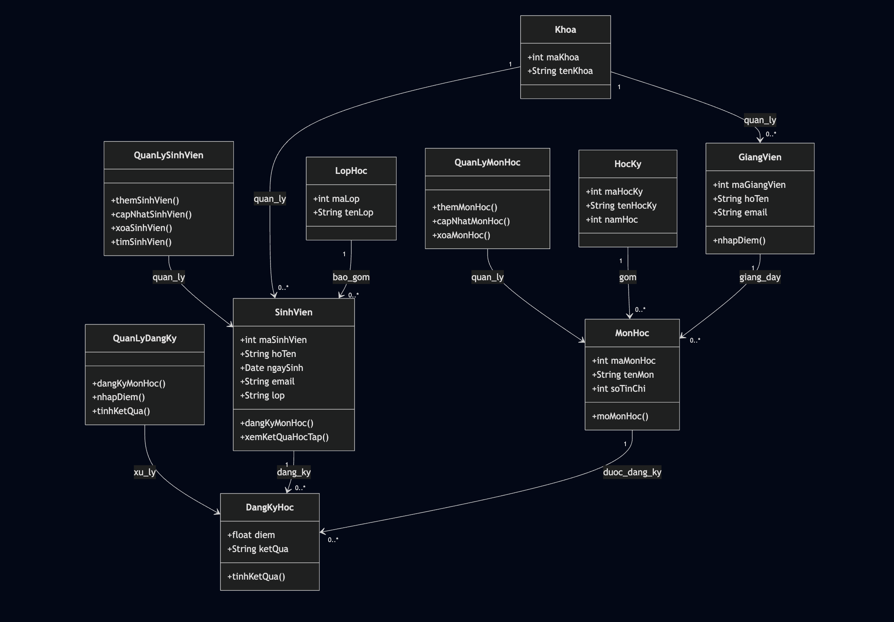

# Student management System
Student Management System là một chương trình hỗ trợ quản lý thông tin sinh viên một cách hiệu quả và có hệ thống. Ứng dụng cho phép lưu trữ, cập nhật và tra cứu các dữ liệu cơ bản của sinh viên như mã sinh viên, họ tên, lớp, chuyên ngành và kết quả học tập.

Chương trình được thiết kế với giao diện đơn giản, dễ sử dụng, giúp giảm thiểu sai sót trong quá trình quản lý thủ công, đồng thời hỗ trợ tìm kiếm nhanh và tổng hợp thông tin khi cần thiết. Hệ thống phù hợp cho mục đích học tập, thực hành và các bài tập/đồ án liên quan đến quản lý dữ liệu sinh viên.

# Hệ thống quản lý sinh viên (Student Management System)

## Giới thiệu
Dự án này tập trung vào **phân tích và thiết kế một hệ thống quản lý sinh viên theo hướng đối tượng (OOP)**.  
Hệ thống hỗ trợ quản lý sinh viên, giảng viên, môn học, học kỳ và quá trình đăng ký học – nhập điểm.

Thiết kế được xây dựng với mục tiêu **dễ triển khai, dễ mở rộng và dễ bảo trì**, phù hợp để hiện thực hóa bằng các ngôn ngữ như Java, C# hoặc Python.

---

## Mục tiêu hệ thống
- Quản lý tập trung thông tin sinh viên và giảng viên  
- Hỗ trợ đăng ký môn học và quản lý kết quả học tập  
- Áp dụng tư duy phân tích – thiết kế hệ thống theo hướng đối tượng  
- Làm nền tảng cho việc phát triển ứng dụng thực tế sau này  

---

## Chức năng chính
- Quản lý sinh viên (thêm, cập nhật, tìm kiếm)  
- Quản lý giảng viên  
- Quản lý môn học và học kỳ  
- Sinh viên đăng ký môn học  
- Giảng viên nhập điểm  
- Xem kết quả học tập  

---

## Phân tích & thiết kế hệ thống

### Thiết kế xử lý (Use Case)
Hệ thống được phân tích dựa trên các nghiệp vụ chính như quản lý sinh viên, đăng ký môn học và nhập điểm.  
Sơ đồ Use Case giúp xác định rõ vai trò của từng tác nhân (sinh viên, giảng viên, quản trị viên) và luồng xử lý nghiệp vụ trong hệ thống.

### Thiết kế dữ liệu (ERD)
Mô hình dữ liệu gồm các thực thể chính: **SinhVien**, **GiangVien**, **MonHoc**, **HocKy** và **DangKyHoc**.  
Quan hệ nhiều–nhiều giữa sinh viên và môn học được giải quyết thông qua bảng trung gian **DangKyHoc**, đảm bảo dữ liệu được chuẩn hóa và nhất quán.

### Thiết kế hướng đối tượng (OOP)
Mỗi thực thể trong hệ thống được ánh xạ thành một lớp đối tượng.  
Các lớp quản lý (QuanLySinhVien, QuanLyMonHoc, QuanLyDangKy) được sử dụng để tách biệt xử lý nghiệp vụ khỏi dữ liệu, tuân thủ nguyên tắc Single Responsibility.

---

## Các lớp chính
- **SinhVien**: lưu trữ thông tin sinh viên và các hành vi liên quan  
- **GiangVien**: quản lý thông tin giảng viên và nhập điểm  
- **MonHoc**: thông tin môn học và số tín chỉ  
- **HocKy**: quản lý học kỳ và năm học  
- **DangKyHoc**: lớp trung gian lưu thông tin đăng ký và điểm số  

---

## Luồng xử lý cơ bản
1. Sinh viên đăng ký môn học  
2. Hệ thống ghi nhận thông tin đăng ký  
3. Giảng viên nhập điểm cho sinh viên  
4. Hệ thống tính toán và lưu kết quả học tập  

---

## Khả năng mở rộng
Hệ thống có thể được mở rộng thêm:
- Tính điểm trung bình (GPA)  
- Quản lý học phí  
- Phân quyền người dùng  
- Thống kê và báo cáo học tập  

---

## Ghi chú
Dự án hiện tập trung vào **phân tích và thiết kế hệ thống**, chưa triển khai chi tiết phần giao diện và cơ sở dữ liệu.  
Thiết kế trong dự án có thể được sử dụng trực tiếp làm nền tảng để phát triển ứng dụng hoàn chỉnh.

---

## Giấy phép
Dự án được sử dụng cho mục đích học tập và nghiên cứu.

# Thông tin thành viên:
- **@congbao2006**: Lê Công Bảo: Thêm các chức năng chính cho chương trình.
- **@Ddawmg18**: Nguyễn Huỳnh Đăng: Code các class Entity và các method đơn giản.
- **@Phunguyen11-02**: Nguyễn Lâm Sỹ Phú: Xử lý các tầng lưu trữ(list/map).
- **@banhthinh1975-crypto**: Bành Phát Thịnh: Sửa lỗi, tạo UI cho chương trình, tìm kiếm data và tài liệu.
