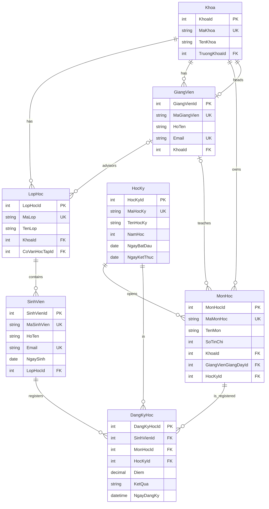

# Phase 1 - Requirement Analysis and Database Design

## 1. Scope mapping from class diagram

This phase maps the class diagram into relational design for SQL Server and later EF Core.

- `Nguoi` is modeled as an abstract base concept in C#, and flattened into two concrete tables:
  - `SinhVien`
  - `GiangVien`
- Main business entities:
  - `Khoa`, `LopHoc`, `SinhVien`, `GiangVien`, `HocKy`, `MonHoc`, `DangKyHoc`
- Main management actions in the diagram will be implemented through service layer in later phases:
  - them/capNhat/xoa cho `SinhVien`, `MonHoc`
  - dangKyMonHoc, nhapDiem, tinhKetQua, xemKetQuaHocTap

## 2. ERD (Mermaid)



## 3. Business constraints

- `Diem` must be in range 0-10.
- A student cannot register the same subject twice in the same semester.
- `SoTinChi` must be in range 1-10.
- `NamHoc` is validated in practical range 2000-2100.
- `KetQua` is automatically derived from `Diem` by trigger:
  - NULL: `Chua co diem`
  - >= 5: `Dat`
  - < 5: `Rot`

## 4. Deliverables created

- SQL schema: `database/schema.sql`
- Seed script: `database/seed.sql`
- This design note: `docs/phase-1-database-design.md`

## 5. Run scripts

Use SQL Server Management Studio or Azure Data Studio:

1. Run `database/schema.sql`
2. Run `database/seed.sql`
3. Verify with:

```sql
SELECT * FROM dbo.Khoa;
SELECT * FROM dbo.SinhVien;
SELECT * FROM dbo.vw_KetQuaHocTap;
```

## 6. Estimated effort for phase 1

- Requirement and class-to-table mapping: 1.5h
- Relational design and constraints: 1.5h
- SQL schema and indexing: 1.0h
- Seed and verification queries: 0.5h

Total estimate: about 4.5 hours.
